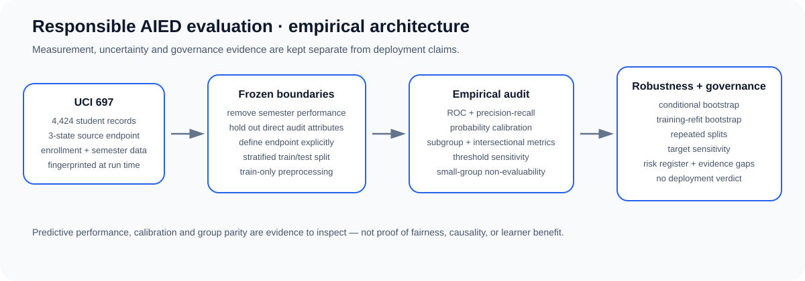
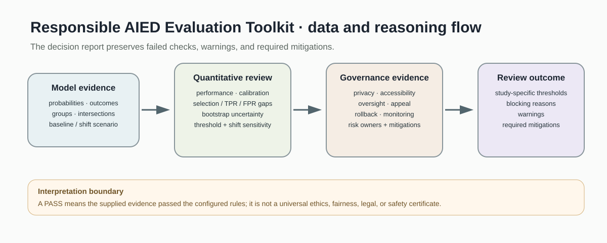
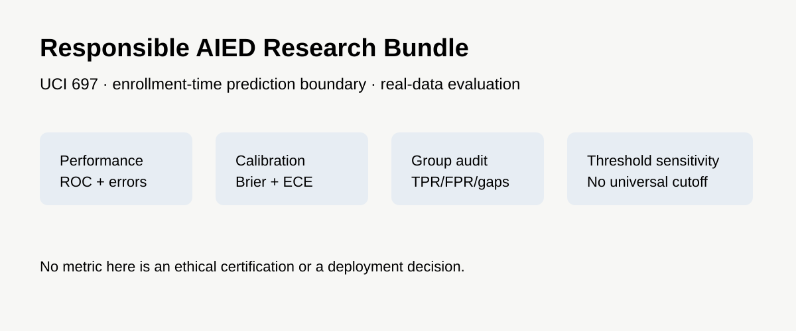
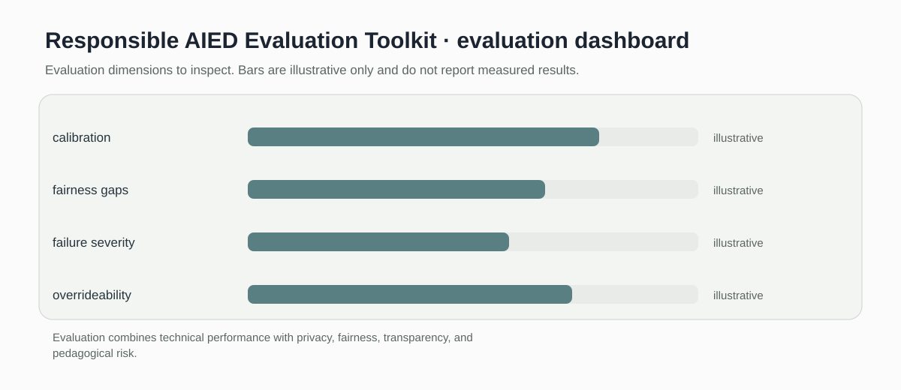

# Responsible AIED Evaluation Toolkit

> Evaluation utilities for demographic parity, calibration error, and deployment gating with privacy and human oversight checks.

[](https://github.com/devissaputra/responsible-aied-evaluation/actions/workflows/ci.yml)



**Area:** Responsible & Human-Centered AIED    
**Status:** working research prototype  
**Author:** Devis Wawan Saputra

## What this project is for

An AIED system can be accurate and still be unsafe, unfair, poorly calibrated, or educationally harmful. This toolkit puts those checks in one place and treats deployment as a gate that requires evidence, not as the automatic next step after model training.

**Who may find it useful:** AIED researchers, reviewers, and product teams evaluating whether an educational AI system is ready for further study or deployment.

## Research questions

1. Where can an AIED system cause uneven performance or pedagogical harm?
2. Are confidence scores calibrated enough for high-stakes use?
3. What evidence is needed before deployment to learners or instructors?

## How it works

The toolkit currently implements two quantitative checks and one governance gate. It measures the largest positive prediction rate gap across groups, calculates expected calibration error, and requires calibration, fairness, privacy review, and human oversight conditions to pass an explicit deployment gate.



Predictions and group labels are converted into fairness and calibration metrics. Those values are then considered alongside privacy review and human oversight flags before the gate returns a decision.



This snapshot shows the bundled synthetic example for Responsible AIED Evaluation Toolkit. It checks the software path; it is not an empirical performance result.

## Methods in the current baseline

- demographic parity difference
- expected calibration error
- explicit metric thresholds
- privacy review flag
- human oversight gate

## Data

Synthetic predictions and subgroup labels are included solely for evaluation demonstrations.

`data/README.md` documents the sample schema and the conditions that should be recorded before any real dataset is connected. Restricted or identifiable learner data should stay outside the repository.

## Run the demo

```bash
git clone https://github.com/devissaputra/responsible-aied-evaluation.git
cd responsible-aied-evaluation
python scripts/run_demo.py
python -m unittest discover -s tests -v
```

The demo intentionally uses a synthetic example with a large parity gap. That makes the failure visible and prevents the sample output from looking like a performance claim.

## What to evaluate next

The next version should add task specific harm analysis, threshold justification, uncertainty, and multiple fairness definitions. Every metric should be connected to a concrete decision and affected population.

## Evaluation view



The Responsible AIED Evaluation Toolkit dashboard is an evaluation checklist rather than a result chart. The bars are illustrative only; the labels show the evidence a real study would need to collect.

## Limits and responsible use

No fairness metric is a universal safety test. The current gate is illustrative and cannot replace legal, ethical, privacy, accessibility, or pedagogical review. See `docs/ethics_and_risks.md` for the broader risk review.

## Repository map

```text
.
├── .github/workflows/ci.yml
├── assets/
│   ├── architecture.svg
│   ├── data_flow.svg
│   ├── demo_snapshot.svg
│   └── evaluation_dashboard.svg
├── data/
│   ├── README.md
│   └── sample.csv
├── docs/
│   ├── ethics_and_risks.md
│   ├── related_work.md
│   └── research_protocol.md
├── reports/model_card.md
├── scripts/run_demo.py
├── src/responsible_aied_evaluation/core.py
├── tests/test_core.py
├── CITATION.cff
├── LICENSE
├── pyproject.toml
└── README.md
```

## Research path

A credible next version would:

1. define a use case and affected population before choosing metrics
2. add severity weighted failure analysis and uncertainty
3. document who can stop deployment and how decisions are appealed

## Related work

`docs/related_work.md` points to open projects that are relevant to this problem area. They are context for comparison and study design; this repository does not present their code as its own.

## Citation and license

`CITATION.cff` contains the software citation. The code and original SVG visuals use the MIT License. Any external dataset keeps its own license and usage conditions.
